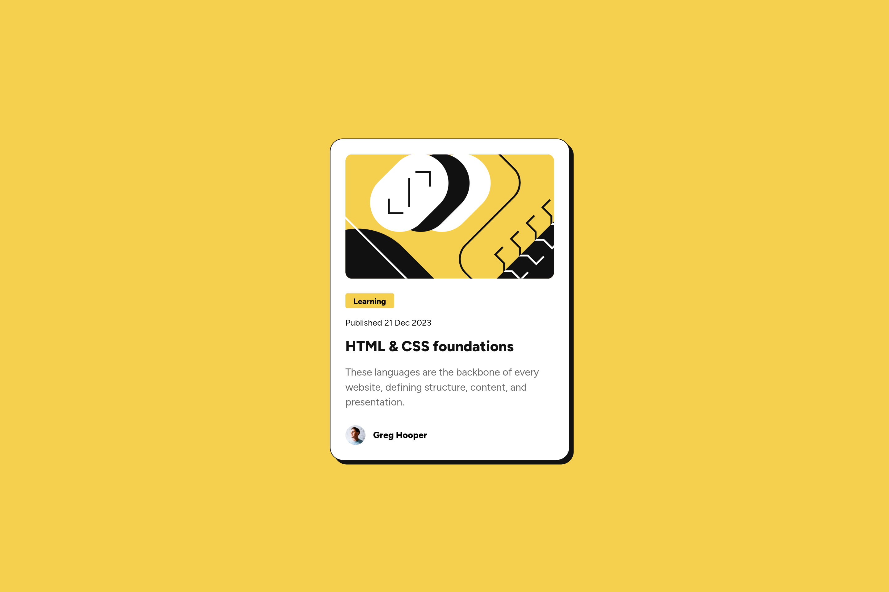
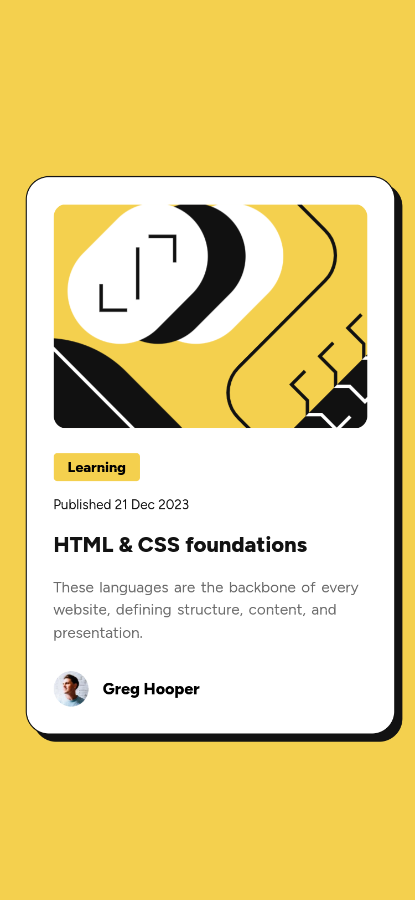

# Frontend Mentor - Blog preview card solution

This is a solution to the [Blog preview card challenge on Frontend Mentor](https://www.frontendmentor.io/challenges/blog-preview-card-ckPaj01IcS). Frontend Mentor challenges help you improve your coding skills by building realistic projects. 

## Table of contents

- [Overview](#overview)
  - [Screenshot](#screenshot)
  - [Links](#links)
- [My process](#my-process)
  - [Built with](#built-with)
  - [What I learned](#what-i-learned)
  - [Continued development](#continued-development)
  - [Useful resources](#useful-resources)
- [Author](#author)

## Overview

### The challenge

### Screenshot

### Links

- [Solution URL](https://www.frontendmentor.io/solutions/blog-preview-card-solution-nemGBX7sN5)
- [Live Site URL](https://frontendmentor-projects-tawny.vercel.app/blog-preview-card-main/)

## My process

### Built with

- Semantic HTML5 markup
- CSS custom properties
- Flexbox
- Mobile-first workflow
- BEM

### What I learned

Tried to use Semantic HTML5 elements again. I am getting good probably. This time mobile first workflow was problematic (I think). The provided design images had different `card` width on mobile and desktop. Also all the elements had different properties too. I only noticed that after finalizing everything (in my mind). Then added some media query 😄

### Continued development

I will continue using Semantic HTML5 elements. Also I will imporve on naming skills with BEM.

### Useful resources

- [MDN css organizing guide](https://developer.mozilla.org/en-US/docs/Learn/CSS/Building_blocks/Organizing) - I tried to follow this to organize css.
- [BEM naming guide](https://getbem.com/naming/) - Used this to make the class naming more consistant.

## Author

- Fediverse - [@wren3n](https://fosstodon.org/@wren3n)
- Frontend Mentor - [wren3n](https://www.frontendmentor.io/profile/wren3n)