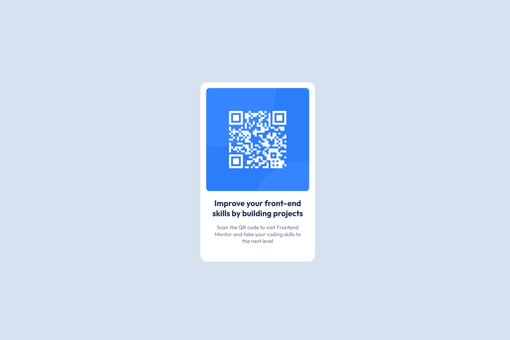

# Frontend Mentor - QR code component solution

This is a solution to the [QR code component challenge on Frontend Mentor](https://www.frontendmentor.io/challenges/qr-code-component-iux_sIO_H). Frontend Mentor challenges help you improve your coding skills by building realistic projects. 

## Table of contents

- [Overview](#overview)
  - [Screenshot](#screenshot)
  - [Links](#links)
- [My process](#my-process)
  - [Built with](#built-with)
  - [What I learned](#what-i-learned)
  - [Continued development](#continued-development)
- [Author](#author)

## Overview

### Screenshot

### Links

- [Solution URL](https://www.frontendmentor.io/solutions/qr-code-J85sDmKa4F)
- [Live Site URL](https://frontendmentor-projects-tawny.vercel.app/qr-code-component-main/)

## My process

### Built with

- Semantic HTML5 markup
- CSS custom properties
- Mobile-first workflow

### What I learned

On this project I learnt about Semantic HTML5 markup. It's neat. Also I did mobile first workflow for the first time 😄

### Continued development

I want to continue learning Semantic HTML5 markup.

## Author

- Fediverse - [@wren3n](https://fosstodon.org/@wren3n)
- Frontend Mentor - [@wren3n](https://www.frontendmentor.io/profile/wren3n)