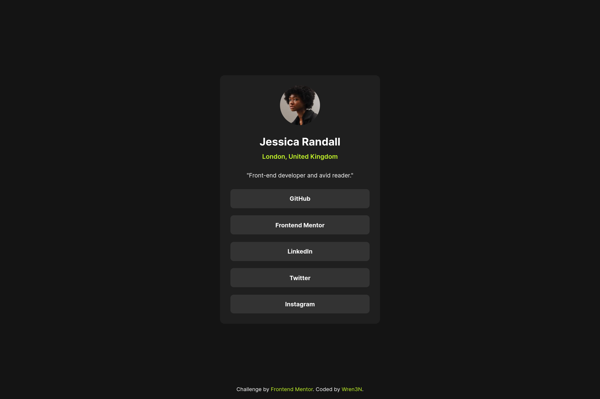
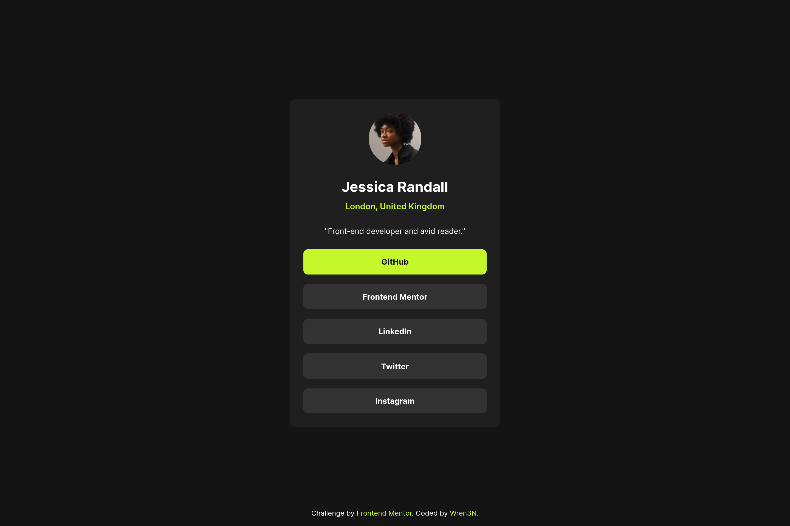
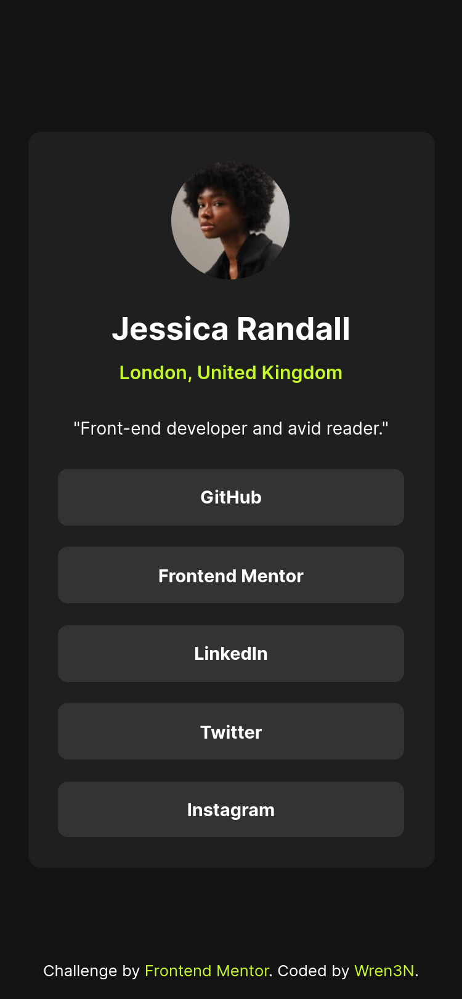

# Frontend Mentor - Social links profile solution

This is a solution to the [Social links profile challenge on Frontend Mentor](https://www.frontendmentor.io/challenges/social-links-profile-UG32l9m6dQ). Frontend Mentor challenges help you improve your coding skills by building realistic projects.

## Table of contents

- [Overview](#overview)
  - [Screenshot](#screenshot)
  - [Links](#links)
- [My process](#my-process)
  - [Built with](#built-with)
  - [What I learned](#what-i-learned)
  - [Continued development](#continued-development)
- [Author](#author)

## Overview

### Screenshot

### Links

- [Solution URL](https://your-solution-url.com)
- [Live site URL](https://frontendmentor-projects-tawny.vercel.app/social-links-profile-main/)

## My process

### Built with

- Semantic HTML5 markup
- CSS custom properties
- Flexbox
- Mobile-first workflow
- BEM

### What I learned

Learned quite a bit more about semantic elements. Tried to use them properly. Don't know if it's good or not. Also tried to give style names some prefix like `c-` for componant and `l-` for layout elements.

### Continued development

I will keep learning semantic elements and BEM.

## Author

- Fediverse - [@wren3n](https://fosstodon.org/@wren3n)
- Frontend Mentor - [@wren3n](https://www.frontendmentor.io/profile/wren3n)
